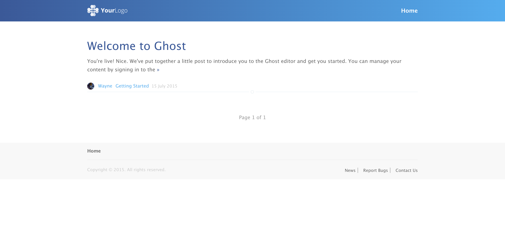
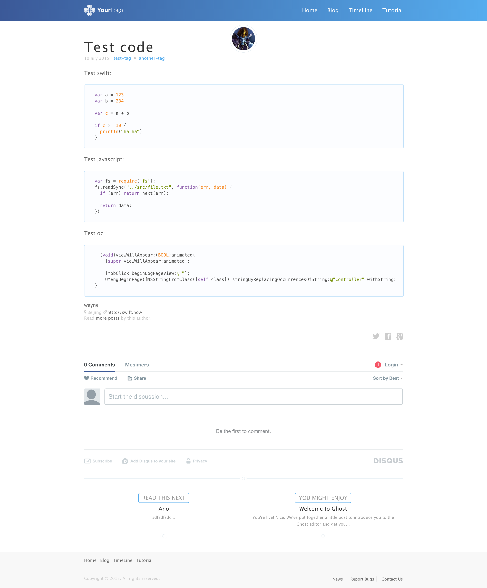

# cuckoo


A ghost theme with minimalist and responsive design. Design(Demo) for https://blog.swift.how



## Key Points
- [x] Disqus Comment Support 💬
- [x] Favicon and Apple Touch Icon Setting 📲
- [x] Highlight Code 💅
- [x] Friendly to Mobile 📱
- [x] Latest Google Analytics Code Support 📈

## How to Install or Use
You should already set up a [ghost blog](https://ghost.org/). If you are not prepared yet, please refer to the official [installation page](http://support.ghost.org/installation/).

When you get ready, just clone the repo to a folder under your blog's theme folder: `content/themes/`. Restart ghost and you can find the `Cuckoo` in the blog setting panel.

### Config for Disqus and Google Analytics
After clone the repo to theme folder, you can find `config.hbs` file under `/cuckoo/partials/custom` folder.
```javascript
{{! Your Google Analytics ID }}
var ga_ua = 'UA-XXXXX-X';

{{! Your Disqus shortname }}
var disqus_shortname = 'example';
```
Override your owner analytics id and shortname, and then refresh the blog. Everything works well and so simple config, right?

## How to Modify or Develop
Keep running your blog in `development` env, so every modify in template files or css style will be loaded with page refresh.

### Sass
Now, we use sass for writing css simply, so you should have sass compiler installed.  
Check if sass already installed.
```sh
sass -v
> Sass 3.4.13 (Selective Steve)
```

### Gulp
Now, we use [gulp](http://gulpjs.com/) tool, make css file concat and compress. Running below code at project root path.
```sh
sudo npm install
```
This command will install all dependencies, then run:
```sh
sudo gulp
```
This command will running default task in `Gulpfile.js`. The task will watch all your `*.scss` file, and parse `cuckoo.scss` file when any change saved. You can read `Gulpfile.js` for more detail info.

### CSS Color Reference
- [NIPPON COLORS - 日本の伝統色](http://nipponcolors.com/)
- [randomColor.js](http://llllll.li/randomColor/)

## Any Bugs
Wake me up, even I am sleeping deeply.
- Add an [issue](https://github.com/SwiftHow/cuckoo/issues)
- Make a pull request (Appreciated)
